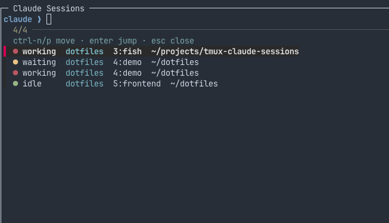

# tmux-claude-sessions

> Inspired by [craftzdog/tmux-claude-session-manager](https://github.com/craftzdog/tmux-claude-session-manager).



A tiny tmux plugin that lists every terminal running [Claude Code](https://claude.com/claude-code)
and lets you jump to one from a popup picker — anywhere in tmux.

```
╭─ Claude Sessions ──────────────────────────────────────────╮
│ claude ❯                                                    │
│   ctrl-n/p move · enter jump · esc close                    │
│ > ● working  my-session1  1:fish  ~/projects/.../project-1 │
│   ● waiting  my-session2  2:fish  ~/projects/.../project-2 │
│   ● idle     dotfiles      3:fish       ~/dotfiles          │
╰────────────────────────────────────────────────────────────╯
```

- **`<prefix>+u`** opens the popup.
- **`Ctrl-n` / `Ctrl-p`** move the selection (arrows work too).
- **`Enter`** jumps your client to the selected pane (session + window + pane).
- **`Esc`** closes the popup.

Each row shows a live status, traffic-light style: **🔴 working** (busy,
leave it), **🟡 waiting** for your input, **🟢 idle** (turn
finished, your move).

## How it works

- **Listing** is by process tree, not config: a pane is listed only when `claude`
  is the pane's own program (the pane shell itself, or a *direct* child of it).
  No registration is needed for a pane to appear; the picker always reflects reality.
- **Status** (working / waiting / idle) is an optional overlay written by Claude
  Code hooks into `~/.cache/claude-tmux-sessions/<pane_id>`, keyed by the
  `$TMUX_PANE` of the Claude process. Without the hooks, sessions still list —
  they just all show `idle`.

## Requirements

- tmux ≥ 3.2 (needs `display-popup`)
- [`fzf`](https://github.com/junegunn/fzf)
- `bash` and `awk` (stock macOS bash 3.2 and BSD awk are fine)

## Install

### With [TPM](https://github.com/tmux-plugins/tpm) (recommended)

Add to `~/.tmux.conf`:

```tmux
set -g @plugin 'KhursandovKamil/tmux-claude-sessions'
```

Then press `<prefix>+I` to install. That's it — `<prefix>+u` now works.

### Manual

```sh
git clone https://github.com/KhursandovKamil/tmux-claude-sessions.git ~/.tmux/plugins/tmux-claude-sessions
```

Add to `~/.tmux.conf` and reload (`<prefix> r`):

```tmux
run-shell ~/.tmux/plugins/tmux-claude-sessions/claude-sessions.tmux
```

## Options

```tmux
set -g @claude-sessions-key 'u'   # key (after prefix) that opens the popup; default: u
```

## Status hooks (Claude Code) — optional

To get the live working / waiting / idle indicators, point Claude Code's hooks at
the bundled `scripts/claude-tmux-state.sh`. Merge this into your
`~/.claude/settings.json` (a ready-to-copy version is in
[`examples/claude-hooks.json`](examples/claude-hooks.json)):

```json
{
  "hooks": {
    "UserPromptSubmit": [
      { "matcher": "", "hooks": [
        { "type": "command", "command": "$HOME/.tmux/plugins/tmux-claude-sessions/scripts/claude-tmux-state.sh working" } ] }
    ],
    "Notification": [
      { "matcher": "permission_prompt", "hooks": [
        { "type": "command", "command": "$HOME/.tmux/plugins/tmux-claude-sessions/scripts/claude-tmux-state.sh waiting" } ] }
    ],
    "PreToolUse": [
      { "matcher": "AskUserQuestion", "hooks": [
        { "type": "command", "command": "$HOME/.tmux/plugins/tmux-claude-sessions/scripts/claude-tmux-state.sh waiting" } ] }
    ],
    "Stop": [
      { "matcher": "", "hooks": [
        { "type": "command", "command": "$HOME/.tmux/plugins/tmux-claude-sessions/scripts/claude-tmux-state.sh idle" } ] }
    ],
    "SessionEnd": [
      { "matcher": "", "hooks": [
        { "type": "command", "command": "$HOME/.tmux/plugins/tmux-claude-sessions/scripts/claude-tmux-state.sh clear" } ] }
    ]
  }
}
```

| Hook event         | Matcher             | Status    | Meaning                        |
| ------------------ | ------------------- | --------- | ------------------------------ |
| `UserPromptSubmit` | —                   | 🔴 `working` | Claude started on your prompt  |
| `Notification`     | `permission_prompt` | 🟡 `waiting` | Asking permission              |
| `PreToolUse`       | `AskUserQuestion`   | 🟡 `waiting` | Asking you a question          |
| `Stop`             | —                   | 🟢 `idle`    | Finished, awaiting next prompt |
| `SessionEnd`       | —                   | ⚪ `clear`   | Removes the pane's status file |

> If your `claude-tmux-state.sh` lives elsewhere (e.g. `~/.claude/scripts/`),
> point the `command` paths there instead. Restart any running Claude sessions so
> they pick up the new hooks.

## Layout

```
claude-sessions.tmux            TPM entry point — binds the popup
scripts/picker.sh               lists Claude panes, runs fzf, jumps
scripts/claude-tmux-state.sh    hook script that records per-pane status
examples/claude-hooks.json      copy-paste hooks for ~/.claude/settings.json
```

## License

MIT
